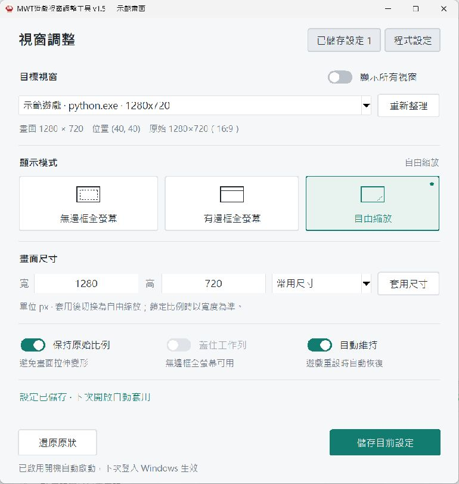

# MWT 遊戲視窗調整工具 v1.5

Windows 上調整遊戲視窗外觀與尺寸的小工具，支援無邊框全螢幕、有邊框全螢幕、自由縮放，以及依程式儲存並自動套用設定。

**[下載 MWT-1.5.exe](https://github.com/bluema9pie-work/mwt-window-resizer/raw/refs/heads/main/MWT-1.5.exe)**

適用於 **Windows 10／11，x64**（實測 Windows 11）。一般使用不需要安裝 Python。執行檔會要求管理員權限，以便調整同樣以管理員權限執行的遊戲視窗。

> **首次執行預設啟用開機自動啟動，工具視窗預設置頂。** 可在右上角「程式設定」關閉。開機啟動的停用選擇會保留；工具置頂選項只影響本次執行。

## 介面預覽



上圖使用自建示範視窗與暫存設定，示範儲存設定、保持比例及自動維持。

## v1.5 更新重點

- **儲存個別程式設定**：例如替楓之谷設定尺寸與顯示模式，下次遊戲開啟時自動套用。
- **開機自動啟動**：首次建立目前 Windows 帳號的登入啟動排程，手動關閉後不會反覆開啟。
- **重新設計的緊湊介面**：目標、顯示模式、尺寸與開關集中在主畫面；儲存與還原固定於底部。
- **全螢幕邊緣修正**：有邊框模式使用原生最大化；無邊框模式處理系統圓角、陰影及自訂外框內縮。
- **穩定性改善**：修正系統匣、視窗還原、背景更新干擾輸入、啟動排程誤報等問題。

## 快速開始

1. 將 `MWT-1.5.exe` 放在預計長期使用的位置，雙擊執行並接受管理員權限提示。
2. 開啟遊戲，在「目標視窗」選取它；找不到時開啟「顯示所有視窗」，或按「重新整理」。遊戲也可以在工具啟動後再開啟。
3. 選擇一種顯示模式，或輸入畫面尺寸後按「套用尺寸」。
4. 如需下次自動套用，按右下角「儲存目前設定」。

| 操作 | 效果 |
| --- | --- |
| 無邊框全螢幕 | 移除一般外框，依設定填滿工作區或完整螢幕；自訂程式內部繪製的工具列不一定會消失 |
| 有邊框全螢幕 | 保留標題列；未鎖定比例時最大化，填滿工作列以外的範圍 |
| 自由縮放 | 解除一般視窗的縮放限制，可拖曳邊框調整 |
| 套用尺寸 | 以客戶區（內容畫面）的像素尺寸調整，並切換至自由縮放 |
| 還原原狀 | 恢復工具第一次記錄到的視窗樣式、位置與尺寸 |

「保持原始比例」開啟時，全螢幕會依原始客戶區比例置中，必要時露出周圍桌面。要填滿整個螢幕，請關閉比例鎖定、使用無邊框全螢幕並開啟「蓋住工作列」。

## 儲存設定與自動套用

以楓之谷為例：

1. 選取遊戲視窗並調整模式、尺寸與選項。
2. 按「儲存目前設定」。新設定預設啟用「遊戲開啟時自動套用」。
3. 保持 MWT 執行，或使用開機自動啟動。遊戲下次開啟後，通常約 1–2 秒會套用對應設定。

右上角「已儲存設定」可查看、立即套用、重新命名、停用自動套用、刪除及復原本次刪除的設定。修改畫面選項後，需要再按「儲存目前設定」才會更新已儲存內容。

- 設定以**程式完整路徑與視窗類別**配對，不依賴視窗標題。同一程式與類別的視窗共用設定，但各視窗的維持狀態獨立。
- 儲存模式、保持比例、蓋住工作列、自動維持，以及自由縮放的內容尺寸與位置。
- 全螢幕依遊戲目前所在螢幕套用；自由縮放的位置若落在已移除的螢幕，會調回可用工作區。
- 最小化的視窗會等還原後才自動套用。按「還原原狀」後，目前這個視窗不會立刻被自動重新套用。
- **MWT 必須保持執行才能偵測遊戲及自動維持。** 遊戲自行重設尺寸時，可開啟「自動維持」並儲存設定。

設定檔位於 `%APPDATA%\MWT\profiles.json`。替換 exe 不會刪除設定，可自行備份此檔。若遊戲移動安裝位置或更換視窗類別，請重新儲存設定。

## 選項與預設值

| 選項 | 預設 | 說明 |
| --- | --- | --- |
| 保持原始比例 | 關閉 | 依第一次記錄的客戶區比例調整；全螢幕可能留白 |
| 蓋住工作列 | 關閉 | 僅供無邊框模式使用；關閉時保留工作列 |
| 自動維持 | 關閉 | 套用模式後可啟用；程式重設尺寸或樣式時自動修復 |
| 遊戲開啟時自動套用 | 新設定開啟 | 符合儲存設定的視窗開啟後自動套用 |
| 關閉時縮到系統匣 | 開啟 | 按 X 收到通知區，持續維持遊戲設定 |
| 工具視窗保持置頂 | 開啟 | 可在「程式設定」關閉；下次執行重新使用預設值 |
| 開機自動啟動 | 首次開啟 | 已有啟動設定時保留原本的啟用／停用狀態 |

### 開機自動啟動

首次執行時，若沒有 MWT 的啟動排程，程式會自動建立目前帳號的 `MWT-WindowResizer-<使用者 SID>` 登入排程。**登入 Windows 後**開啟工具主視窗，不是在登入前執行。設定成功後才會在介面顯示啟用。

- 排程使用最高可用權限及互動式登入，不儲存密碼。
- 在「程式設定」關閉後，排程保留為停用狀態，以記住選擇；不會停止目前的 MWT。
- 若刪除整個排程，下次開啟工具會視為尚未設定並重新建立。要持續關閉，請使用程式內的開關或停用排程。
- 請保留 exe 的位置。若移動程式，開啟新位置的 MWT 後，在「程式設定」按「更新位置」。
- 建立或讀取失敗時會顯示原因，可重試；權限不足時請以管理員身分執行。

### 系統匣與快捷鍵

按 X 預設縮到右下角通知區；單擊或雙擊圖示可開回工具，右鍵選「結束」才會完全關閉。圖示可能被收在通知區的隱藏圖示中。

| 快捷鍵 | 操作 |
| --- | --- |
| F5 | 重新整理目標視窗 |
| Ctrl+S | 儲存目前設定 |
| Enter | 在尺寸輸入欄位套用尺寸 |
| Esc | 從設定頁返回視窗調整 |
| Tab／空白鍵 | 移動焦點／操作按鈕與開關 |

## 從舊版升級

1. 從舊版系統匣選「結束」。
2. 將 `MWT-1.5.exe` 放到固定位置，再開啟新版。
3. 檢查「程式設定」中的開機啟動狀態；若顯示「更新位置」，按下後等待完成。

既有的 `%APPDATA%\MWT\profiles.json` 可沿用。1.5 的後續修正版若在相同位置替換同名 exe，可沿用該位置的啟動排程。

## 從原始碼執行

需要 Windows、Python 3.10 以上與 tkinter；執行只使用 Python 標準函式庫，不需要額外安裝套件。

請保留 `mwt.py`、`ui.py`、`profiles.py`、`startup.py` 與 `assets/mushroom.ico`，在專案資料夾中執行：

```powershell
python mwt.py
```

原始碼模式也會嘗試初始化開機啟動，需從管理員終端機執行；排程會記錄 Python 與 `mwt.py` 的位置。

## 常見問題與限制

- **找不到遊戲**：開啟「顯示所有視窗」並重新整理；確認遊戲已建立可見視窗。
- **仍有周圍留白**：檢查比例鎖定；若希望覆蓋工作列，使用無邊框模式並開啟「蓋住工作列」。程式可能有自己的繪圖或尺寸限制。
- **視窗大小一直被改回**：開啟「自動維持」。若程式拒絕外部調整，工具會顯示錯誤。
- **畫面變模糊**：本工具調整視窗與內容區，不會提高遊戲內部渲染解析度。請先提高遊戲內設定的解析度。
- **遊戲遮住其他視窗**：覆蓋工作列時會管理目標的置頂狀態，切到其他程式會取消；「還原原狀」或結束工具也會清除受管理的置頂。

## 警告與免責

**本工具不是修改遊戲內容之外掛、輔助操作外掛或作弊軟體。** 僅透過 Windows 系統介面調整遊戲視窗外觀與尺寸，不讀寫遊戲記憶體、不修改遊戲檔案、不注入程式碼。

請勿將本工具用於任何違反遊戲服務條款、干擾他人遊戲體驗或其他非法用途。使用本工具即表示您了解並同意：一切風險由使用者自行承擔，作者不對帳號停權、遊戲異常、資料損失或任何衍生後果負責。
